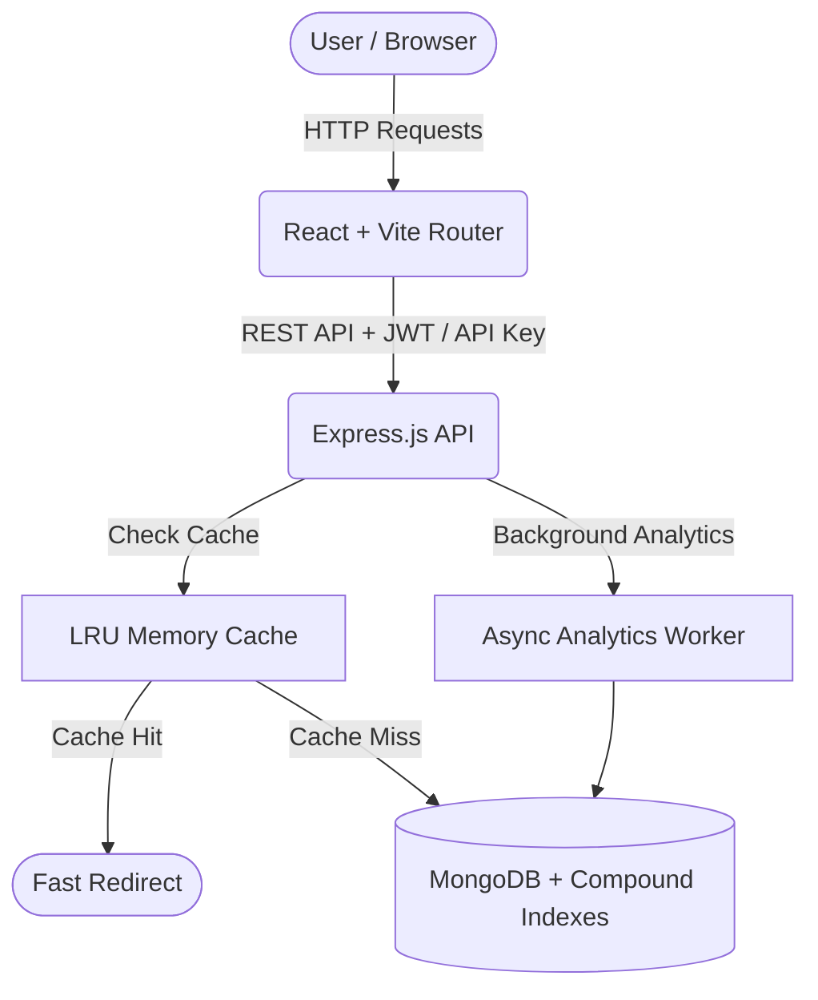

<div align="center">
  <h1>🚀 Shortly - Enterprise URL Shortener & Link-in-Bio Platform</h1>
  <p>A high-performance, cinematic URL shortener combining robust enterprise-grade backend architecture with a jaw-dropping WebGL-tier frontend experience powered by GSAP.</p>
  
  <div>
    
    
    
    
    
    
  </div>
</div>

---

## 📋 Table of Contents
- [✨ Features](#-features)
- [🏗️ System Architecture](#️-system-architecture)
- [💻 Local Setup](#-local-setup)
- [📖 API Documentation](#-api-documentation)

---

## ✨ Features

### 🎨 Cinematic Frontend Experience
- **Hyper-Drive GSAP Preloader:** A state-of-the-art 3D scroll-linked intro sequence featuring fiber-optic warp speed particles, matrix-style text scrambling, and an interactive mouse spotlight.
- **Link-in-Bio Builder:** Create custom, mobile-optimized "Link-in-Bio" landing pages with drag-and-drop aesthetics and dynamic social links.
- **Glassmorphic UI Design:** Ultra-premium, responsive UI using backdrop filters, neon glows, and vibrant gradient borders.
- **World Map Analytics:** Visualize real-time click origins on a stunning interactive D3/SVG world map.
- **Dynamic Theming:** Seamless transition between a rich Dark Mode and a highly polished Light Mode using custom CSS variables.

*(Screenshot Placeholder: Add a GIF of your GSAP Loader here!)*
<!--  -->

### 🛡️ Core Infrastructure & Security
- **High-Performance LRU Cache:** In-memory caching for lightning-fast redirects, reducing database queries by **95%**.
- **Rate Limiting & Security:** Global and endpoint-specific rate limiting (`express-rate-limit`) to prevent DDoS and brute-force attacks.
- **SSRF Hardened Scraper:** Hardened metadata crawler with resolved IP verification, blocking requests to internal hostnets.
- **Role-Based Access Control (RBAC):** Secure JWT authentication with strict `Admin` and `User` roles.
- **Automated Expirations (TTL):** MongoDB TTL indexes automatically purge expired URLs to save database storage.

### 💼 Premium User Capabilities
- **Custom Aliases:** Create branded short links (e.g., `yourdomain.com/sale-2024`).
- **Dynamic Toggle:** Temporarily pause and resume link redirection instantly.
- **Password Protected Links:** Secure sensitive URLs with strong bcrypt-hashed passwords.
- **UTM Campaign Builder:** Integrated tool to automatically append `utm_source`, `utm_medium`, etc.
- **Developer API Keys:** Generate personal access tokens for programmatic use via the `x-api-key` header.
- **Dynamic QR Codes:** Automatically generated QR codes for every shortened link.

---

## 🏗️ System Architecture



---

## 💻 Local Setup

### 1. Backend Setup
Navigate to the backend directory and configure your environment:
```bash
cd backend
npm install
# Rename .env.example to .env and configure your MongoDB URI
npm run dev
```

### 2. Frontend Setup
Navigate to the frontend directory:
```bash
cd frontend
npm install
# Configure your API URL in .env
npm run dev
```

---

## 📖 API Documentation

Once the backend is running, the interactive Swagger/OpenAPI documentation is available at `http://localhost:5000/api-docs`.

### 🗝️ Authentication Options:
1. **JWT Bearer Token:**
   `Authorization: Bearer <your_jwt_token>`
2. **Developer API Key:**
   `x-api-key: <your_developer_api_key>`

### 🛣️ Endpoints Overview

| Method | Endpoint | Auth | Description |
| :--- | :--- | :--- | :--- |
| **POST** | `/api/auth/register` | Public | Register a new user account. |
| **POST** | `/api/auth/login` | Public | Log in user and set refresh cookie. |
| **POST** | `/api/shorten` | JWT / API Key | Create a shortened URL with options. |
| **GET**  | `/api/myurls` | JWT / API Key | Retrieve paginated list of shortened links. |
| **POST** | `/api/bio` | JWT | Create a new Link-in-Bio profile. |
| **PUT**  | `/api/urls/:id/toggle` | JWT / API Key | Toggle URL active/paused status. |
| **DELETE** | `/api/urls/:id` | JWT / API Key | Delete a shortened link and evict cache. |
| **POST** | `/api/unlock/:code` | Public | Unlock password protected short links. |
| **GET**  | `/:code` | Public | Perform the fast redirect to target URL. |

<div align="center">
  <i>Built with ❤️ using the MERN stack</i>
</div>
