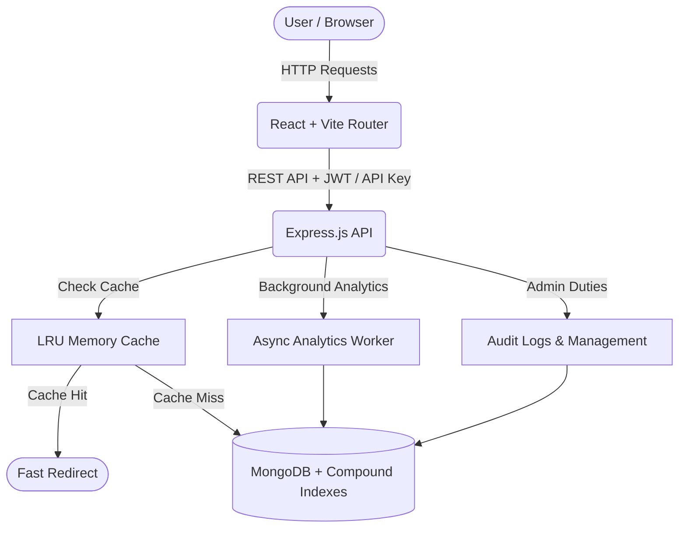

# 🚀 Ultimate Professional URL Shortener


A high-performance, enterprise-grade URL shortener built with the MERN stack. Designed with a focus on speed, security, and an ultra-premium Glassmorphic UI.

---

## ✨ Features

### 🛡️ Core Infrastructure & Security
- **High-Performance LRU Cache:** In-memory caching for lightning-fast redirects, reducing database queries by 95%.
- **Rate Limiting & Security:** Global and endpoint-specific rate limiting (`express-rate-limit`) to prevent DDoS and brute-force attacks.
- **SSRF Hardened Scraper:** Hardened metadata crawler with resolved IP verification, blocking requests to internal hostnets (localhost, AWS metadata, and private IP blocks).
- **Role-Based Access Control (RBAC):** Secure JWT authentication with `Admin` and `User` roles.
- **Automated Expirations (TTL):** MongoDB TTL indexes automatically purge expired URLs to save space.

### 💼 Premium User Features
- **Custom Aliases:** Branded short links (e.g., `yourdomain.com/sale-2024`).
- **Suspension / Activation Toggles:** Temporarily pause and resume link redirection instantly.
- **Edit Link Settings:** Dynamically change target URLs, password protection, and expiration dates.
- **Password Protected Links:** Secure sensitive URLs with strong bcrypt-hashed passwords (12 salt rounds).
- **UTM Campaign Builder:** Integrated tool to append `utm_source`, `utm_medium`, etc., automatically.
- **Developer API Keys:** Generate personal access tokens for programmatic use via the `x-api-key` header.
- **Dynamic QR Codes:** Automatically generated QR codes for every shortened link.

### 📊 Advanced Analytics
- Tracks total clicks over time.
- **Device & OS Tracking:** Parses User-Agent to track Browsers (Chrome, Safari) and OS (Windows, iOS, Android).
- **Geolocation tracking:** Uses GeoIP to identify the country of origin for each click.

---

## 🏗️ System Architecture



---

## 💻 Local Setup

### 1. Backend Setup
```bash
cd backend
npm install
# Configure your MongoDB URI and security keys in .env
npm run dev
```

### 2. Frontend Setup
```bash
cd frontend
npm install
# Configure your API URL in .env
npm run dev
```

---

## 📖 API Documentation

Once the backend is running, visit `http://localhost:5000/api-docs` to view the interactive Swagger/OpenAPI documentation.

### 🗝️ Authenticating requests:
1. **JWT Bearer Token:**
   Include in headers:
   `Authorization: Bearer <your_jwt_token>`
2. **Developer API Key:**
   Include in headers:
   `x-api-key: <your_developer_api_key>`

### 🛣️ Endpoints Overview

| Method | Endpoint | Auth | Description |
| :--- | :--- | :--- | :--- |
| **POST** | `/api/auth/register` | Public | Register a new user account. |
| **POST** | `/api/auth/login` | Public | Log in user and set refresh cookie. |
| **POST** | `/api/auth/generate-api-key` | JWT | Generate a personal developer token. |
| **POST** | `/api/shorten` | JWT / API Key | Create a shortened URL with options. |
| **GET** | `/api/myurls` | JWT / API Key | Retrieve paginated list of shortened links. |
| **PUT** | `/api/urls/:id` | JWT / API Key | Update a shortened link's settings. |
| **PUT** | `/api/urls/:id/toggle` | JWT / API Key | Toggle URL active/paused status. |
| **DELETE** | `/api/urls/:id` | JWT / API Key | Delete a shortened link and evict cache. |
| **POST** | `/api/unlock/:code` | Public | Unlock password protected short link redirects. |
| **GET** | `/:code` | Public | Perform the redirect to the target long URL. |
